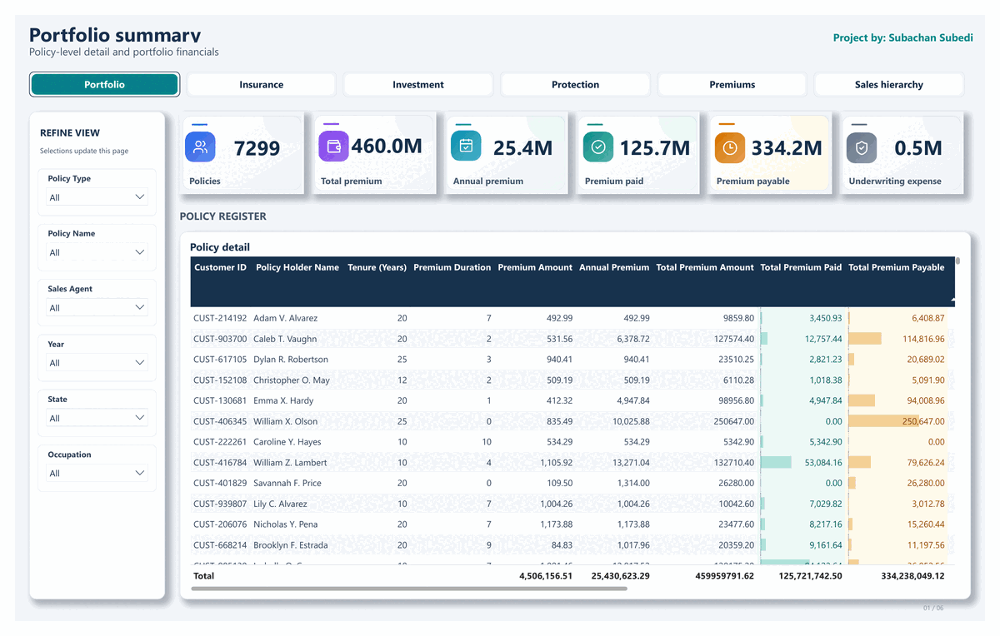

# Insurance Portfolio Intelligence

**A Power BI case study connecting portfolio composition, modeled premium exposure and data-quality review across 10,000 insurance records.**

The central question: **where is premium concentrated, what does the policy mix reveal, and which measures are reliable enough to support a decision?**


[Snapshot](#executive-snapshot) · [Insights](#key-insights) · [Implementation](#technical-implementation) · [Full report](Business Report/insurance-portfolio-business-report.pdf) · [Limitations](#limitations)

<table>
  <tr>
    <th>Active records</th>
    <th>Modeled annual premium</th>
    <th>Modeled premium paid</th>
    <th>Top three states</th>
  </tr>
  <tr>
    <td align="center"><strong>7,332</strong></td>
    <td align="center"><strong>$25.43m</strong></td>
    <td align="center"><strong>$125.72m</strong></td>
    <td align="center"><strong>33.71%</strong> of annual premium</td>
  </tr>
</table>

*Scope: active records in the stored model, matching the report-level filter. Premium paid is calculated from annual premium and payment duration; it is not a verified cash-receipt total.*

## Dashboard preview

<p align="center">
  
</p>

The report definitions contain six pages: **Portfolio summary**, **Insurance overview**, **Investment & maturity**, **Premium & protection**, **Premium performance**, and **Sales hierarchy**.

[View all six dashboard pages](Dashboard Pdf/insurance_dashboard.pdf)


*Actual page from the supplied Power BI export. The report pairs every screenshot with its filter context, an explanation of the visuals and management use.*

The Premium & protection screenshot uses a 20–25-year tenure range. Premium performance selects **Payable in 10 Years**. Their displayed totals therefore represent different selections from the portfolio summary.

## Executive snapshot

The project combines **seven CSV source tables**, a policy fact table and supporting customer, product and management dimensions. Its six-page report explores policy mix, premium measures and the sales hierarchy.

Three findings frame the case study:

- **The portfolio is concentrated.** Two protection plans represent **55.63%** of all records; three states account for **33.71%** of active modeled annual premium.
- **Premium definitions matter.** Active modeled lifetime premium totals **$459.96m**, of which **27.33%** is modeled as paid. The remaining amount includes future tenure and is not an overdue balance.
- **Data quality changes the interpretation.** **76.30%** of all records lack Region. That issue limits regional reporting even though the primary dimension identifiers reconcile.

The detailed [management report](Business Report/insurance-portfolio-business-report.pdf) explains the calculations, supporting evidence and recommended controls.

## Business problem

Policy data, customer attributes, product definitions and sales assignments sit in separate source files. A useful management view needs to connect them while keeping policy counts, premium frequency, lifetime amounts and status filters consistent.

This project addresses four practical questions:

1. How is the portfolio distributed across policy statuses and protection plans?
2. Which segments account for the most modeled annual premium?
3. How do modeled paid and remaining premium relate to lifetime premium?
4. Which data and calculation issues must be resolved before operational use?

This is an **insurance portfolio analytics** case study. The supplied materials do not contain advertising spend, campaign performance or marketing attribution data.

## Key insights

| Finding | Verified evidence | Business interpretation |
|---|---|---|
| Active records dominate the snapshot | **7,332 / 10,000 records — 73.32%** | Establishes portfolio status mix; it is not a retention rate. |
| Two plans carry most records | ULIP Growth Plan **3,205**; Life Assurance **2,358** | Start product-level data and service reviews with the largest segments. |
| Active annual premium is concentrated | Minnesota **$3.21m**, Wisconsin **$2.82m**, New Jersey **$2.54m** | Together, **33.71%** of the active total; describes the project portfolio, not wider market demand. |
| Most modeled lifetime premium remains | **$334.24m**, or **72.67%**, in active records | Future-tenure exposure should be separated from actual collections and arrears. |
| Status concentration needs validation | All **107 lapsed** and **37 claimed** records are assigned to Indiana | Check source segmentation before drawing geographic conclusions. |

*Product and status counts use all records. Premium findings use active records. Rounded amounts are for readability; shares are calculated from unrounded totals.*

## Recommendations

**1. Repair regional coverage first.** Trim split state tokens, rebuild the state-to-region join and reconcile assignments. Region is blank for **7,630 records**, including **5,576 active records**.

**2. Make KPI definitions explicit.** Distinguish fact rows, distinct policy numbers and customers. Label paid and remaining premiums as modeled values until transaction data is available.

**3. Reconcile return logic before using it.** Review premium thresholds, product-name conditions and maturity assumptions. Maturity, profit and ROI are excluded from the headline findings because the inspected formulas need correction.

**4. Validate the final delivery.** Test refresh, filters, navigation and security roles in Power BI Desktop. The supplied dashboard PDF documents the captured views.

These are recommendations from the review—not completed business interventions or evidence of improved revenue.

## Technical implementation

### Data preparation and modeling

- **Seven CSV sources:** policy records, customers, agents, protection plans, policy types, regional managers and zonal managers.
- **Nine Power Query tables:** the seven sources plus derived hierarchy and region tables.
- **Eight business relationships:** six fact-to-dimension links, a hierarchy-to-manager link and a fact-to-region link; this count excludes automatic date structures.
- **11 explicit measures**, supported by calculated columns for premium, duration and related indicators.
- Report definitions include slicers, field parameters and bookmark-controlled hierarchy views.

The six primary dimension keys are unique, and their fact-table foreign keys have no unmatched non-null values in the inspected snapshot. The separate state-based regional join remains incomplete.

### Premium logic

| Indicator | Model calculation |
|---|---|
| Annual premium | Source premium × payment-frequency factor |
| Lifetime premium | Annual premium × tenure |
| Payment duration | Year-boundary difference between Start Date and Last Paid Date |
| Modeled premium paid | Annual premium × payment duration |
| Modeled remaining premium | Lifetime premium − modeled premium paid |
| Paid share | Total modeled paid premium ÷ total modeled lifetime premium |

The source files supply USD monetary amounts. Coverage, premium, loan allowance and underwriting amounts serve different analytical purposes; the report keeps their definitions separate. Headline premium figures are independently aggregated from the stored model.

### Report design

The revised definitions use navy navigation, teal accents, a light canvas, white cards and darker text. The design retains the six-page structure while standardizing KPI treatments, slicers and navigation. The supplied PDF shows the rendered report pages. Interactive behavior and refresh were not tested in this review.

### What this case study demonstrates

The materials show work across source preparation, model relationships, DAX, report design and analytical validation. The business value is a clearer view of portfolio composition and premium assumptions, together with an explicit account of where the model needs correction. No measured commercial uplift is claimed.

## Documentation

| Resource | Contents |
|---|---|
| [Management and technical report](Business Report/insurance-portfolio-business-report.pdf) | Fourteen-page report with numbered contents, exact totals, findings, KPI definitions, all six dashboard screenshots with page-by-page explanations, limitations and recommended actions. |
| [Analytical summary](Img/portfolio-insights.png) | Verified status distribution and active premium concentration. |

[Dashboard PDF](Dashboard Pdf/insurance_dashboard.pdf) contains the six supplied report pages.

## Limitations

- **Dataset coverage:** the portfolio includes 22 U.S. states; representativeness of the broader market has not been established.
- **Static snapshot:** purchase dates span **July 24, 2015–July 23, 2025**. The report is not a live service deployment.
- **Unconfirmed policy grain:** **10,000 rows** contain **9,938 distinct policy numbers**. Repeated IDs require explanation before deduplication or unique-policy reporting.
- **Incomplete Region:** **76.30%** of rows are blank after the state-based join.
- **Financial assumptions:** modeled paid amounts are not verified collections; return formulas need business-rule validation.
- **Security and delivery:** manager-role expressions require correction and role tests. The exported views were inspected; refresh and interactive behavior were not tested.
- **No outcome attribution:** there is no evidence of revenue uplift, claim profitability, employee performance improvement or advertising effectiveness.

## Repository structure

```text
Insurance Analysis/
├── README.md
├── Dataset/
│   ├── DM.Regional_Manager.csv
│   ├── DM.Policy_Type.csv
│   ├── DM.Zonal_Manager.csv
│   ├── DM.Customer_Detail_Table.csv
│   ├── DM.Insurance_Agent_Table.csv
│   ├── FCT.Insurance_Policy_Table.csv
│   └── DM.Policy_Protection_Plan.csv
├── Dashboard Pdf/
│   └── insurance_dashboard.pdf
├── Business Report/
│   └── insurance-portfolio-business-report.pdf
└── Img/
    ├── dashboard-demo.gif
    ├── hero.svg
    ├── portfolio-insights.png
    └── dashboard/
        ├── page-1.png
        ├── page-2.png
        ├── page-3.png
        ├── page-4.png
        ├── page-5.png
        └── page-6.png
```

## Author and contact

For project discussion, use the repository owner's GitHub profile. No unverified contact details or credentials are included here.
