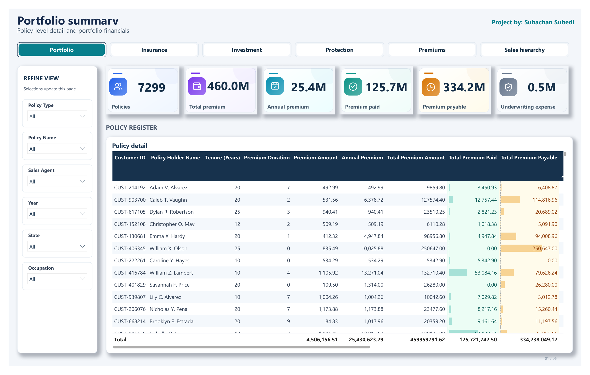
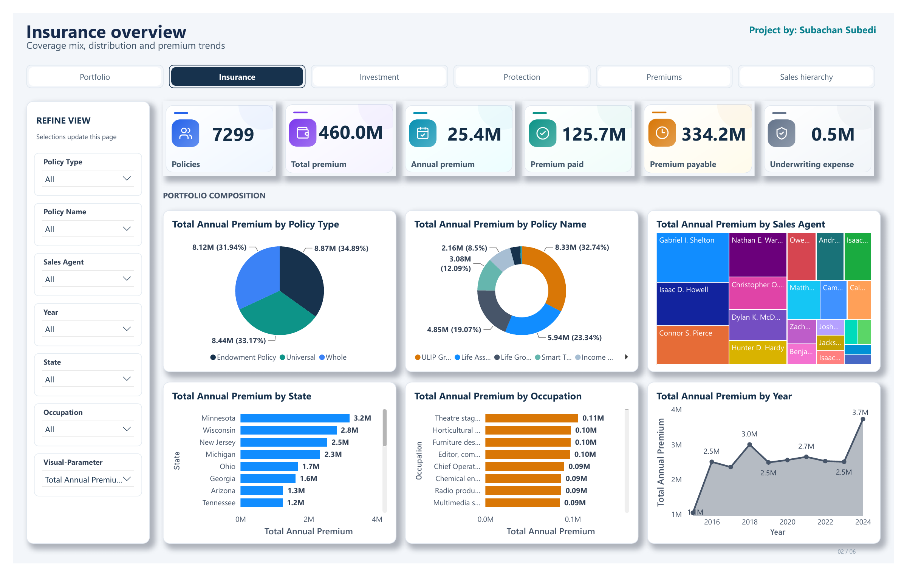
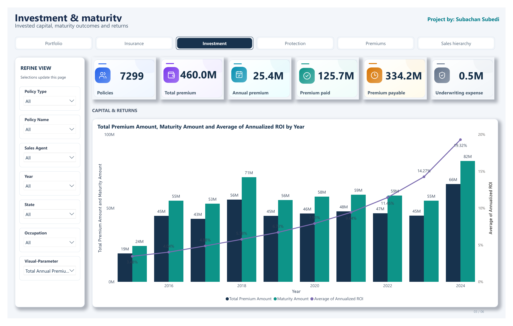
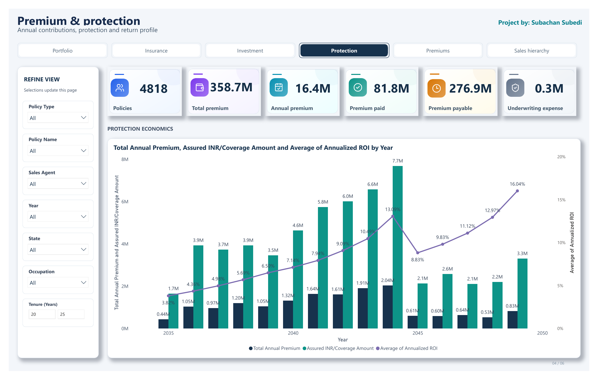
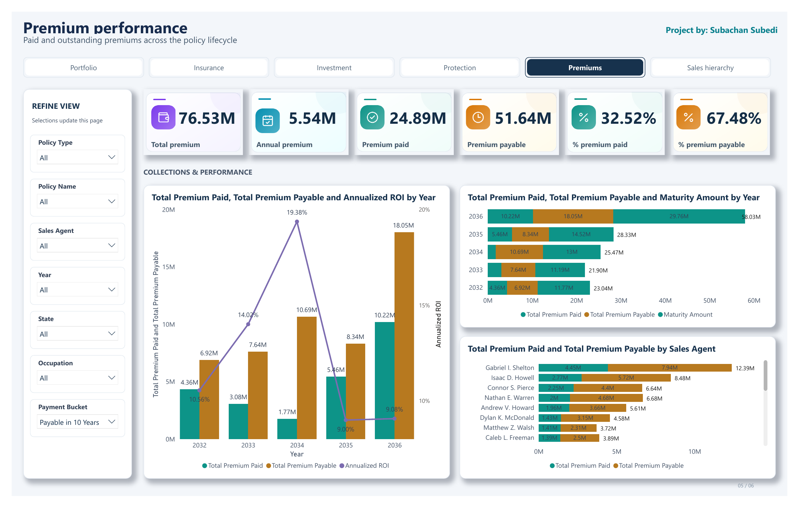
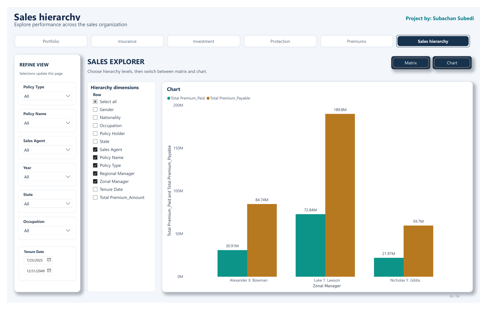
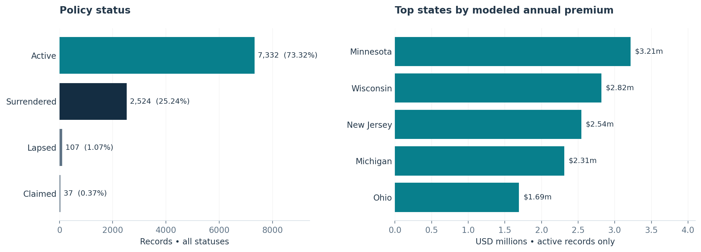

<p align="center">
  
</p>

<h1 align="center">Insurance Portfolio Intelligence</h1>

<p align="center">
  <strong>A Power BI case study that transforms policy, customer, product and sales-hierarchy data into clear portfolio and premium decisions.</strong>
</p>

<p align="center">
  
  
  
  
  
</p>

<p align="center">
  <a href="Dashboard%20Pdf/insurance_dashboard.pdf">📊 Dashboard PDF</a> •
  <a href="Business%20Report/insurance-portfolio-business-report.pdf">📘 Business Report</a> •
  <a href="#key-insights">💡 Key Insights</a> •
  <a href="#technical-implementation">⚙️ Technical Build</a> •
  <a href="#business-recommendations">🎯 Recommendations</a>
</p>

---

<table>
  <tr>
    <td align="center" width="20%"><strong>📋 10,000</strong><br><sub>Policy Records</sub></td>
    <td align="center" width="20%"><strong>✅ 7,332</strong><br><sub>Active Records</sub></td>
    <td align="center" width="20%"><strong>💳 $25.43M</strong><br><sub>Annual Premium</sub></td>
    <td align="center" width="20%"><strong>💰 $125.72M</strong><br><sub>Modeled Premium Paid</sub></td>
    <td align="center" width="20%"><strong>📍 33.71%</strong><br><sub>Top 3 States' Share</sub></td>
  </tr>
</table>

<sub><strong>KPI scope:</strong> premium figures and geographic share use active records in the stored model. Modeled premium paid is calculated from annual premium and payment duration; it is not a verified cash-receipt total.</sub>

## 📊 Dashboard Experience

The dashboard presents six connected analytical views. Each page answers a different management question while retaining a consistent navigation, filter and KPI system. Select any preview to open the complete dashboard PDF.

<table>
  <tr>
    <td width="50%"><a href="Dashboard%20Pdf/insurance_dashboard.pdf"></a></td>
    <td width="50%"><a href="Dashboard%20Pdf/insurance_dashboard.pdf"></a></td>
  </tr>
  <tr>
    <td align="center"><strong>Portfolio Summary</strong><br><sub>Policy-level register, headline financial KPIs and portfolio filters</sub></td>
    <td align="center"><strong>Insurance Overview</strong><br><sub>Status, protection-plan, occupation and state-level portfolio patterns</sub></td>
  </tr>
  <tr>
    <td width="50%"><a href="Dashboard%20Pdf/insurance_dashboard.pdf"></a></td>
    <td width="50%"><a href="Dashboard%20Pdf/insurance_dashboard.pdf"></a></td>
  </tr>
  <tr>
    <td align="center"><strong>Investment &amp; Maturity</strong><br><sub>Investment-oriented measures, maturity views and policy comparisons</sub></td>
    <td align="center"><strong>Premium &amp; Protection</strong><br><sub>Premium composition, protection mix and tenure-based exploration</sub></td>
  </tr>
  <tr>
    <td width="50%"><a href="Dashboard%20Pdf/insurance_dashboard.pdf"></a></td>
    <td width="50%"><a href="Dashboard%20Pdf/insurance_dashboard.pdf"></a></td>
  </tr>
  <tr>
    <td align="center"><strong>Premium Performance</strong><br><sub>Modeled paid and payable premium across selected policy segments</sub></td>
    <td align="center"><strong>Sales Hierarchy</strong><br><sub>Agent, regional-manager and zonal-manager reporting views</sub></td>
  </tr>
</table>

<p align="center">
  <a href="Dashboard%20Pdf/insurance_dashboard.pdf"><strong>Open the complete six-page dashboard PDF →</strong></a>
</p>

> [!NOTE]
> Dashboard pages can contain different active selections. For example, the supplied Premium &amp; Protection view uses a 20–25-year tenure range, while Premium Performance selects **Payable in 10 Years**. Totals should therefore be interpreted within each page's filter context.

## 🧭 Executive Snapshot

This project connects **seven CSV source tables** into a Power BI model that analyzes policy activity, product mix, premium exposure, geography and the sales hierarchy. The solution is designed to help management move from isolated operational records to a consistent portfolio-level view.

The analysis answers four practical questions:

1. How is the portfolio distributed across policy statuses and protection plans?
2. Which states and products account for the largest premium concentration?
3. How do modeled paid and remaining premium relate to total lifetime premium?
4. Which data-quality and calculation issues should be resolved before operational use?

Three findings frame the management story:

- **Portfolio concentration:** two protection plans represent **55.63%** of all records.
- **Premium concentration:** Minnesota, Wisconsin and New Jersey account for **33.71%** of active modeled annual premium.
- **Reporting constraint:** **76.30%** of all records have a blank Region value, limiting regional analysis.

For calculations, supporting evidence and page-by-page dashboard explanations, see the full [business report](Business%20Report/insurance-portfolio-business-report.pdf).

## 🏢 Business Problem

Policy, customer, product, agent and manager information is stored across separate files. Without a connected analytical model, management cannot easily compare portfolio status, premium exposure, protection plans, locations and sales assignments using the same definitions and filter context.

The project addresses this gap by combining the source tables into a reusable semantic model and presenting the results through an executive-friendly six-page dashboard. It also distinguishes descriptive portfolio findings from measures that require additional business-rule or source-system validation.

<a id="key-insights"></a>

## 💡 Key Insights

### ✅ Active policies dominate the stored portfolio

The dataset contains **7,332 active records out of 10,000**, equal to **73.32%** of all rows. This describes the recorded status mix; it should not be interpreted as a customer-retention rate.

### 🛡️ Two protection plans carry most records

**ULIP Growth Plan** contains **3,205 records**, while **Life Assurance** contains **2,358**. Together they account for **55.63%** of the portfolio, making them the clearest starting point for product-level service and data reviews.

### 📍 Active annual premium is geographically concentrated

| State | Active modeled annual premium | Portfolio interpretation |
|---|---:|---|
| **Minnesota** | **$3.21M** | Largest state-level amount in the active portfolio |
| **Wisconsin** | **$2.82M** | Second-largest active annual-premium contribution |
| **New Jersey** | **$2.54M** | Third-largest active annual-premium contribution |
| **Top three combined** | **33.71%** | Share of total active modeled annual premium |

These results describe the project dataset and do not establish broader insurance-market demand.

### 💰 Most modeled lifetime premium remains payable

Active modeled lifetime premium totals **$459.96M**. Of this amount, **$125.72M**, or **27.33%**, is modeled as paid and **$334.24M**, or **72.67%**, remains. The remaining amount includes future policy tenure and is not an overdue balance.

### 🔎 Geographic status concentration requires validation

All **107 lapsed** and **37 claimed** records are assigned to Indiana in the inspected snapshot. This may reflect the source population or a data assignment issue, so it should be validated before geographic conclusions are used operationally.

<p align="center">
  
</p>

<a id="business-recommendations"></a>

## 🎯 Business Recommendations

| Priority | Recommended action | Management purpose |
|---|---|---|
| **1 — Regional data quality** | Standardize state values, rebuild the state-to-region mapping and reconcile blank assignments. | Restore confidence in regional and management-hierarchy reporting. |
| **2 — KPI governance** | Define fact rows, distinct policy numbers and customers separately in the report glossary. | Prevent different audiences from interpreting the same KPI differently. |
| **3 — Premium definitions** | Keep modeled paid, remaining and lifetime premium clearly labeled and separate from transaction-level collections. | Avoid treating future policy value as cash received or overdue. |
| **4 — Return logic** | Review premium thresholds, product-name conditions and maturity assumptions before using ROI, profit or maturity outputs. | Ensure financial indicators follow approved business rules. |
| **5 — Delivery testing** | Validate refresh, filters, navigation, relationships and security roles in Power BI Desktop. | Confirm that the analytical experience works as designed after deployment. |

These recommendations come from the analytical review. They are not completed interventions and do not represent measured revenue or performance improvements.

## 🧠 Analytical Approach

The project combines source preparation, semantic modeling, DAX calculations, dashboard design and analytical validation.


| Model layer | Role in the solution | Verified detail |
|---|---|---|
| Fact table | Stores policy-level records and analytical amounts | 10,000 rows and 9,938 distinct policy numbers |
| Customer dimension | Adds policyholder and demographic attributes | Linked to the policy fact table |
| Product dimensions | Define policy type and protection-plan attributes | Primary keys are unique in the inspected snapshot |
| Sales dimensions | Organize agent, regional-manager and zonal-manager assignments | Used by the hierarchy reporting page |
| Derived tables | Support hierarchy and region analysis | Region mapping remains incomplete |
| Measures | Provide reusable portfolio and premium KPIs | 11 explicit measures were identified |

<a id="technical-implementation"></a>

## ⚙️ Technical Implementation

### Data preparation and modeling

- **Seven CSV sources:** policy records, customers, agents, protection plans, policy types, regional managers and zonal managers
- **Nine Power Query tables:** the seven sources plus derived hierarchy and region tables
- **Eight business relationships:** six fact-to-dimension links, one hierarchy-to-manager link and one fact-to-region link
- **11 explicit measures:** supported by calculated columns for premium, duration and related indicators
- **Interactive report design:** slicers, field parameters, filters and bookmark-controlled hierarchy views

The six primary dimension keys are unique, and their corresponding fact-table foreign keys have no unmatched non-null values in the inspected snapshot. The separate state-based regional join remains incomplete.

### Premium calculation framework

| Indicator | Model calculation |
|---|---|
| Annual premium | Source premium × payment-frequency factor |
| Lifetime premium | Annual premium × tenure |
| Payment duration | Year-boundary difference between Start Date and Last Paid Date |
| Modeled premium paid | Annual premium × payment duration |
| Modeled remaining premium | Lifetime premium − modeled premium paid |
| Paid share | Total modeled paid premium ÷ total modeled lifetime premium |

The source files contain USD monetary amounts. Coverage, premium, loan allowance and underwriting amounts represent different business concepts and are kept separate in the analysis.

### Dashboard design system

The dashboard uses a light analytical canvas, navy navigation, teal accents, white KPI cards and darker text for improved contrast. The six pages follow a shared visual system for spacing, headings, filters and navigation while preserving their individual analytical purpose.

## 🖥️ Dashboard Capabilities

- Portfolio-level KPI cards and policy-detail reporting
- Status, protection-plan, occupation and geographic analysis
- Annual, lifetime, paid and remaining premium views
- Tenure, policy type, policy name, state, year and agent filtering
- Agent-to-manager sales-hierarchy exploration
- Bookmark-controlled hierarchy views and consistent page navigation
- Six-page static dashboard export for portfolio presentation

## 💼 Project Value

This project demonstrates the ability to:

- Translate an insurance-management problem into measurable analytical questions
- Prepare and connect fact and dimension data with Power Query
- Build reusable DAX measures and calculated business indicators
- Design a cohesive, executive-level Power BI dashboard
- Validate relationships, keys, filter context and KPI definitions
- Convert descriptive findings into practical management recommendations
- Document a BI solution for both business and technical audiences

## 📚 Project Documentation

| Resource | Description | Link |
|---|---|---|
| **Dashboard PDF** | Static export of all six dashboard pages | [Open dashboard](Dashboard%20Pdf/insurance_dashboard.pdf) |
| **Business report** | Detailed management report covering purpose, data, KPIs, findings, page explanations, technical approach, recommendations and limitations | [Open report](Business%20Report/insurance-portfolio-business-report.pdf) |
| **Source datasets** | Seven CSV files used by the portfolio model | [Browse datasets](Dataset/) |

## ⚠️ Interpretation and Limitations

- The portfolio contains records from **22 U.S. states**; broader market representativeness has not been established.
- Purchase dates range from **July 24, 2015 to July 23, 2025**. The repository represents a static analytical snapshot.
- The **10,000 fact rows** contain **9,938 distinct policy numbers**. Repeated identifiers require explanation before deduplication or unique-policy reporting.
- Region is blank for **7,630 records**, including **5,576 active records**, after the current state-based join.
- Modeled premium paid is not a verified collections total, and remaining premium is not equivalent to arrears.
- Maturity, profit and ROI logic requires business-rule validation before it is used for management decisions.
- The supplied report export was reviewed; interactive refresh, navigation and security-role behavior require final testing in Power BI Desktop.
- The analysis does not establish revenue uplift, claim profitability, employee-performance improvement or causal relationships.

## 📁 Repository Structure

```text
Insurance Analysis/
├── README.md
├── Dataset/
│   ├── DM.Regional_Manager.csv
│   ├── DM.Policy_Type.csv
│   ├── DM.Zonal_Manager.csv
│   ├── DM.Customer_Detail_Table.csv
│   ├── DM.Insurance_Agent_Table.csv
│   ├── FCT.Insurance_Policy_Table.csv
│   └── DM.Policy_Protection_Plan.csv
├── Dashboard Pdf/
│   └── insurance_dashboard.pdf
├── Business Report/
│   └── insurance-portfolio-business-report.pdf
└── Img/
    ├── hero.svg
    ├── portfolio-insights.png
    └── dashboard/
        ├── page-1.png
        ├── page-2.png
        ├── page-3.png
        ├── page-4.png
        ├── page-5.png
        └── page-6.png
```

---

<div align="center">

### Insurance Portfolio Intelligence

**From policy-level data to clear portfolio decisions**

<sub>Power BI · Power Query · DAX · Data Modeling · Insurance Analytics · Business Intelligence</sub>

</div>
